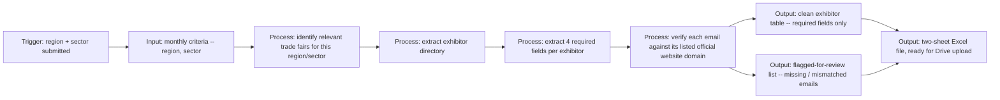

# Proposal - Web Data Extraction Specialist

**Job URL:** https://www.upwork.com/jobs/~022089992682519595507
**Live demo:** https://trade-fair-exhibitor-scraper-demo.streamlit.app/
**Repo:** https://github.com/PureGit90/trade-fair-exhibitor-scraper-demo

---

## 1. Demo Link (line 1)

**Live demo: https://trade-fair-exhibitor-scraper-demo.streamlit.app/**
Built a working version of the exact monthly deliverable described in the post: pick a region
and sector, it identifies the relevant trade fairs, pulls exhibitor records with the four
required fields, flags anything it can't verify instead of guessing, and outputs the Excel file
ready for the Drive folder.

## 2. Hook

I built the actual monthly pipeline you described, not a description of one: region + sector in,
trade fairs identified, exhibitor directory extracted into company name / country / official
website / corporate email, and a clean Excel file out.

## 3. Demo Reference

- Takes a region and sector and identifies the relevant trade fairs for that criteria
- Extracts exhibitor records with exactly the four fields required: company name, country,
  official website, corporate email address
- Verifies every email against its listed official website domain and flags mismatches or
  missing entries instead of presenting a guess as fact -- shown in a separate "Flagged for
  review" view so nothing silently disappears
- Produces a two-sheet Excel export: clean records ready to upload, plus a flagged sheet with
  the reason for each hold
- Screenshot attached

## 4. Architecture

**Trigger:** Region + sector submitted for the month
**Input:** Monthly criteria (region, sector) and the relevant trade fair exhibitor directories
**Processing:** Identify relevant trade fairs, extract exhibitor records from each directory,
verify each corporate email against its listed official website domain
**Output:** Clean exhibitor table (four required fields) plus a two-sheet Excel file
**Verification:** Verified vs. flagged counts, with a specific reason shown per flagged row
(missing / domain mismatch)

## 5. Tech Stack & Timeline

**Stack:** Python, web-scraping / AI data-extraction tooling (Thunderbit, Browse AI, Octoparse,
or Apify depending on the target directory's structure), pandas for structured cleanup and
verification, openpyxl for the Excel export, Google Drive API for the final upload once criteria
are locked in.

**Timeline:** This month's batch ready within 3-4 days of receiving your region/sector criteria.

**What you get from month one:**
- Trade fairs identified for your first region/sector criteria
- Exhibitor directories extracted into the exact four fields you specified
- A clean Excel file uploaded to your Drive folder, plus a flagged list for anything that
  couldn't be verified rather than guessed at

## 6. Pricing

**$150/month fixed**, matching your posted rate exactly. Covers identifying that month's
relevant trade fairs for your chosen region/sector criteria, extracting exhibitor records for
the four required fields, and delivering the completed Excel file to your Drive folder.

**Phase 2 (natural add-on once the first month's pipeline is running):** once the extraction and
verification process is built and tuned to your criteria, adding a second region or sector is a
smaller lift than the first -- the pipeline itself doesn't change, only the input parameters do.
That also means the manual effort on your end doesn't grow much even as trade fair volume
increases month to month, since the verification and formatting logic stays the same regardless
of how many fairs are covered.

---

## Notes for Marco (Gate 2)

- Client: Da Nang, Vietnam. 72 jobs posted, 52% hire rate, $5K total spent, 42 hires, 4.9 rating
  (33 reviews). Established, legitimate recurring buyer -- not a first-timer, not a 0%-hire-rate
  filter case.
- Budget is a real stated number ($150/month fixed, recurring), not a placeholder -- bid exactly
  that per the closing playbook (match established buyers' stated rate on a first engagement,
  don't negotiate up).
- Scope is explicitly narrow: no CRM, no outreach, no lead qualification, no business analysis.
  Just identify fairs, extract the four fields, upload the Excel. The proposal and demo stay
  scoped to exactly that -- padding this with extra "value-adds" beyond the stated scope would
  work against the fit here.
- Required tool experience named in the post: Thunderbit, Browse AI, Octoparse, ParseHub, Apify,
  Clura, Chat4Data "or an equivalent platform." Demo doesn't name a specific tool since it's a
  region/sector-agnostic pipeline demo, not a live scrape -- worth naming one or two of these
  tools by name in the Upwork message to hit their stated requirement directly.
- This is a recurring monthly retainer, which is a different shape from most of the pipeline's
  proposals (usually one-off builds) -- if it lands, it's a small but steady monthly line, and a
  second region/sector add-on (Phase 2) would roughly double it without much added effort.
- Demo repo pushed standalone per repo-isolation policy; Streamlit Cloud deploy and screenshot
  capture still need to happen before this goes out (handled separately, not by this build task).
