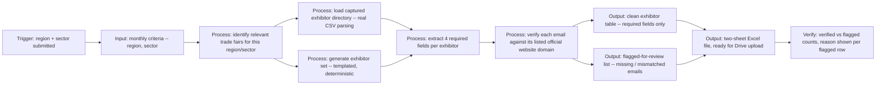

# Workflow -- Trade Fair Exhibitor Extractor

## What the pipeline catches in the sample data

1. **Real file parsing, not just mock JSON** -- the Germany + Manufacturing combination loads
   `sample_data/hannover_messe_exhibitors_sample.csv` through actual `pandas.read_csv`, the same
   step that would run against a file exported by a scraping tool (Thunderbit, Browse AI,
   Octoparse, etc.) before it's cleaned and verified.
2. **Missing email, not guessed** -- two rows in the sample CSV (Kastner Sensorik GmbH, Brandt
   Hydraulik GmbH) have no email in the source data. The pipeline leaves the field blank in the
   clean export and lists them in "Flagged for review" instead of inventing a plausible-looking
   address.
3. **Domain mismatch, not silently accepted** -- Wagner Prazisionswerkzeuge GmbH lists an email
   at `wagner-tools.de` while its official website is `wagner-werkzeuge.de`. The verification
   layer catches the mismatch and flags it for a manual check rather than presenting it as
   confirmed.
4. **Deterministic generation for any region/sector** -- combinations without a captured sample
   file (e.g. Vietnam + Textiles, Brazil + Packaging) use a seeded generator, so the same inputs
   always produce the same exhibitor set. That's what makes the pipeline demonstrably
   region/sector-agnostic instead of a one-off script for a single fair.

## Source types this pipeline handles today

| Source type | How it's read |
|---|---|
| Captured exhibitor directory export (CSV) | `pandas` structured row parsing |
| Region/sector with no captured file | Deterministic templated generation (stand-in for a live scrape/AI-extraction pass) |
| Email verification | Domain-match check against the listed official website |

Adding a new captured trade fair means dropping a CSV with the same four columns into
`sample_data/` and adding one entry to the catalog in `app.py` -- the extraction, verification,
and export logic downstream doesn't change per fair or per region.
